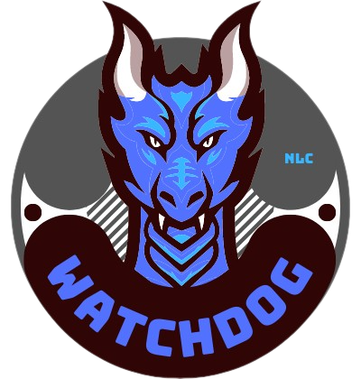
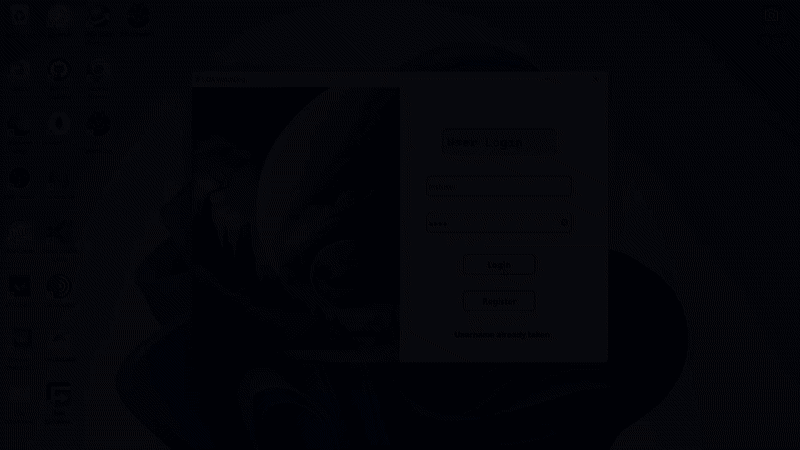
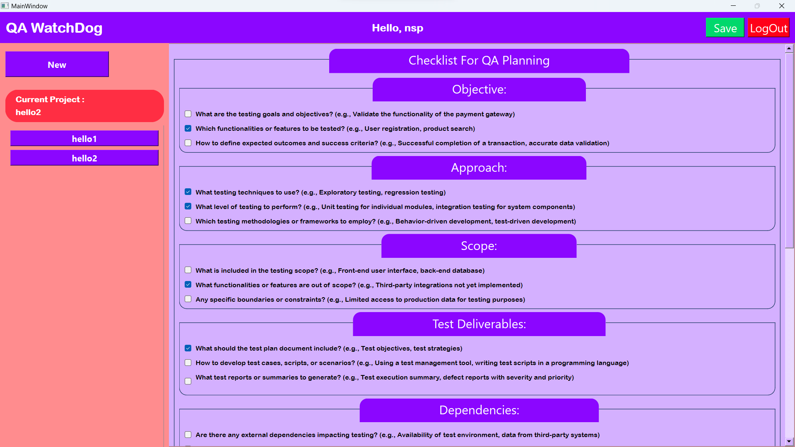
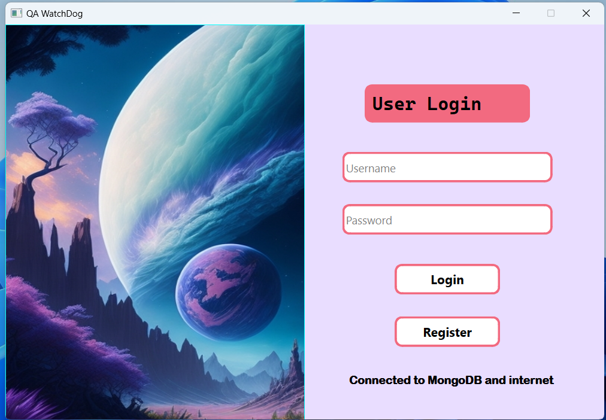

# QA WatchDog: Simplifying Your QA Testing Process

QA WatchDog is a Python-based tool meticulously crafted by Neeraj Singh to streamline Quality Assurance (QA) testing. With a focus on ease of use and collaboration, this tool empowers QA testers to efficiently track progress and manage their testing checklists.

## Download Now
📥 [Download QA WatchDog](https://github.com/neerajlovecyber/QA-WatchDog/releases/download/release/QA-WatchDog-Setup.exe)

⚠️ **Requires Internet**: Please note that QA WatchDog requires an internet connection for online authentication.

## Features at a Glance
- **Secure Multi-User Login**: Collaborate seamlessly as multiple users can log in simultaneously.
- **Simple Installation**: Install with ease using the setup file from the [Releases](https://github.com/neerajlovecyber/QA-WatchDog/releases) page.
- **Organize with Multiple Checklists**: Manage all your QA test checklists conveniently within a single account.

### Quick Overview

## Explore QA WatchDog

Home Tab           |  Security Tab
:-------------------------:|:-------------------------:
  |  

## Getting Started
1. **Download**: Get the setup file from our [Releases](https://github.com/neerajlovecyber/QA-WatchDog/releases) page.
2. **Install**: Run the downloaded file to breeze through the installation process.
3. **Launch**: Open the app, create your account, and dive in!
4. **Explore**: Start crafting checklists and experience smoother QA testing.

## We Value Your Input
- **License**: QA WatchDog operates under the MIT License, allowing you to modify and distribute it as per the license terms.
- **Connect with Neeraj**: Have questions, ideas, or just want to say hello? Email Neeraj Singh at neerajlovecyber@gmail.com or connect on [LinkedIn](https://www.linkedin.com/in/neerajlovecyber/).

Your feedback, suggestions, and contributions are invaluable to us!
